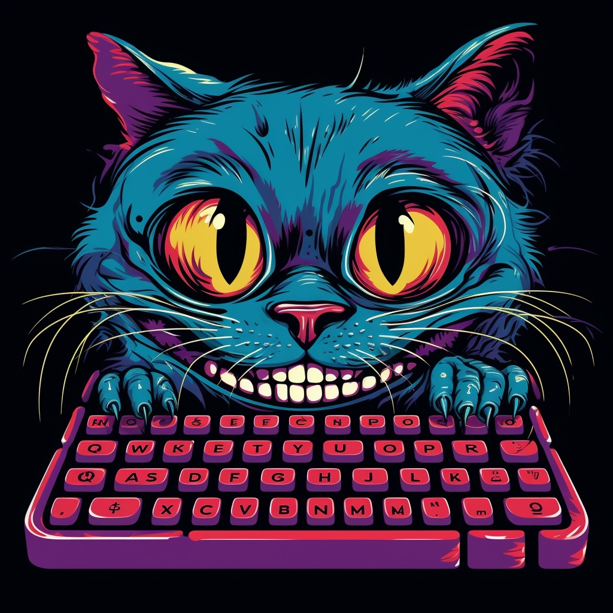

# Hello, dear!

## What is this?
{width="40%"align="right"}
The Cheshire Cat is an open-source framework that allows you to develop intelligent agents on top of many 
[Large Language Models](how-the-cat-works.md#components) (LMM).
You can develop your custom AI architecture to assist you in a wide range of tasks.

The Cheshire Cat embeds a [long-term memory](how-the-cat-works.md#components) system to save the user's input locally 
and answer informed by the context of previous conversations. 
You can also feed text documents in the Cat's memory system to enrich the agent's contextual information and ask it to 
retrieve them further in the conversation.
The Cat currently supports `.txt`, `.pdf` and `.md` files.

If you want the Cat to solve tailored tasks you can extend its capabilities writing Python [plugins](plugins/plugins.md)
to execute custom functions or call external services (e.g. APIs and other models).   
   
If you want to build your custom AI architecture, the Cat can help you:

- :earth_africa: Language model agnostic
- :elephant: Long term memory
- :tools: Can use external tools
- :material-file-document: Can ingest documents (.txt, .pdf)
- :rocket: Extendible via [plugins](plugins/plugins.md) in Python
- :whale2: 100% [dockerized](https://docs.docker.com/get-docker/)

**Don't forget to give the project a star! ⭐ Thanks again!🙏**

## Currently Available LLMs
This is the list of currently supported LMMs:

- GPT3
- ChatGPT
- Cohere
- HuggingFace Hub
- HuggingFace endpoints

[//]: # (## Roadmap)

[//]: # ()
[//]: # (- QA / tests)

[//]: # (- docs and tutorials)

[//]: # (- online demo)

[//]: # (- voice interface)

[//]: # (- more plugins shipped by default)

[//]: # (- &#40;surprise!!!&#41; PURR)

[//]: # ()

[//]: # (## Contributing)

[//]: # ()
[//]: # (If you have a suggestion that would make this better, open an issue and we can reason about it.)

[//]: # ()
[//]: # (If you want to contribute code, fork the repo and create a pull request.)

[//]: # ()
[//]: # ()
[//]: # (1. Try out the Cat)

[//]: # ()
[//]: # (1. Fork the Project)

[//]: # ()
[//]: # (2. Create your Feature Branch &#40;`git checkout -b feature/AmazingFeature`&#41;)

[//]: # ()
[//]: # (3. Commit your Changes &#40;`git commit -m 'Add some AmazingFeature'`&#41;)

[//]: # ()
[//]: # (4. Push to the Branch &#40;`git push origin feature/AmazingFeature`&#41;)

[//]: # ()
[//]: # (5. Open a Pull Request &#40;&#40;if it contains lots of code, please discuss it beforehand opening a issue&#41;&#41;)

[//]: # ()
[//]: # ()
[//]: # (You can start simply by:)

[//]: # ()
[//]: # (- Making tutorials and docs)

[//]: # ()
[//]: # (- Sharing on social media)

[//]: # ()
[//]: # ()
[//]: # (Don't forget to give the project a star! ⭐ Thanks again!🙏)

___Which way to go from here?___   

    "Would you tell me, please, which way I ought to go from here?"
    "That depends a good deal on where you want to get to," said the Cat.
    "I don't much care where--" said Alice.
    "Then it doesn't matter which way you go," said the Cat.

    (Alice's Adventures in Wonderland - Lewis Carroll)

__Credits__

Logo image generated with MidJourney, prompted by [Edgars Romanovskis](https://www.linkedin.com/in/edgars-romanovskis-b28826259/)
